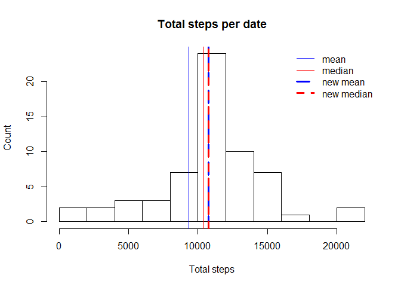

-   [Loading and preprocessing the
    data](#loading-and-preprocessing-the-data)
-   [Loading the data](#loading-the-data)
    -   [What is mean total number of steps taken per
        day?](#what-is-mean-total-number-of-steps-taken-per-day)
    -   [What is the average daily activity
        pattern?](#what-is-the-average-daily-activity-pattern)
    -   [Imputing missing values](#imputing-missing-values)
    -   [Are there differences in activity patterns between weekdays and
        weekends?](#are-there-differences-in-activity-patterns-between-weekdays-and-weekends)

    library("ggplot2")
    library(dplyr)
    library(xtable)

Loading and preprocessing the data
----------------------------------

Loading the data
================

    if(!file.exists("activity.csv")){
        activity <- read.csv("activity.csv", header = TRUE, sep = ",")
        summary(activity)
    }else
    {
        unzip("activity.zip")
        activity <- read.csv("activity.csv", header = TRUE, sep = ",")
        summary(activity)
    }

    ##      steps                date          interval     
    ##  Min.   :  0.00   2012-10-01:  288   Min.   :   0.0  
    ##  1st Qu.:  0.00   2012-10-02:  288   1st Qu.: 588.8  
    ##  Median :  0.00   2012-10-03:  288   Median :1177.5  
    ##  Mean   : 37.38   2012-10-04:  288   Mean   :1177.5  
    ##  3rd Qu.: 12.00   2012-10-05:  288   3rd Qu.:1766.2  
    ##  Max.   :806.00   2012-10-06:  288   Max.   :2355.0  
    ##  NA's   :2304     (Other)   :15840

What is mean total number of steps taken per day?
-------------------------------------------------

    grpDate <- activity %>% 
               group_by(date) %>% 
               summarise(Total_steps=sum(steps,na.rm = TRUE))

    Mean_Total_steps <- mean(grpDate$Total_steps, na.rm = TRUE)
    Median_Total_steps <-median(grpDate$Total_steps, na.rm = TRUE)
    # Make a plot 
    hist(grpDate$Total_steps,xlab="Total steps", ylab="Count",main = "Total steps per date",breaks = 10)
    abline(v=Mean_Total_steps,col = "blue",lwd=3)
    abline(v=Median_Total_steps,col = "red",lwd=3)
    legend(x="topright", legend=c("mean","median"), col=c("blue","red"), bty="n", lwd=3)

The mean and median of the total number of steps taken per day are:  
\* Mean = 9354.2295082  
\* Median = 10395

What is the average daily activity pattern?
-------------------------------------------

    grpInterval <- activity %>%
                  group_by(interval) %>%
                  summarise(Avrg=mean(steps,na.rm = TRUE))
    MaxIntervalAvrg <- grpInterval[grpInterval$Avrg==max(grpInterval$Avrg,na.rm = TRUE),]
    plot.new()
    plot(grpInterval$interval,grpInterval$Avrg, type = 'l',
         xlab = 'Interval',ylab = 'Average by interval',main = 'Average by interval')

 The
5-minute interval which contains the maximum number of steps is: 835,
206.1698113

Imputing missing values
-----------------------

Total of missing values.

    Total_Missing_Value <- is.na(activity$steps)
    table(Total_Missing_Value)

    ## Total_Missing_Value
    ## FALSE  TRUE 
    ## 15264  2304

The missing values is raplace by the mean for that 5-minute interval.

    activity_copy <- activity
    for(ii in unique(activity_copy$interval))
    {
    activity_copy$steps[is.na(activity_copy$steps) & (activity_copy$interval == ii)] =  grpInterval$Avrg[grpInterval$interval==ii]
    }

    grpDateN <- activity_copy %>% 
               group_by(date) %>% 
               summarise(Total_steps=sum(steps,na.rm = TRUE))

    Mean_Total_stepsN <- mean(grpDateN$Total_steps, na.rm = TRUE)
    Median_Total_stepsN <-median(grpDateN$Total_steps, na.rm = TRUE)
    # Make a plot 
    hist(grpDateN$Total_steps,xlab="Total steps", ylab="Count",main = "Total steps per date",breaks = 10)
    abline(v=Mean_Total_steps,col = "blue",lwd=1)
    abline(v=Median_Total_steps,col = "red",lwd=1)
    abline(v=Mean_Total_stepsN,col = "blue",lty=5,lwd=3)
    abline(v=Median_Total_stepsN,col = "red",lty=2,lwd=3)
    legend(x="topright", legend=c("mean","median","new mean","new median"), col=c("blue","red","blue","red"), bty="n", lwd=c(1,1,3,3),lty = c(1,1,5,2))

 \#
the new Mean and median steps for each date are:  
\* Mean = 1.076618910^{4}  
\* Median = 1.076618910^{4}

Are there differences in activity patterns between weekdays and weekends?
-------------------------------------------------------------------------

    activity_copy$DayG <- factor(weekdays(as.Date(activity_copy$date)) %in% c("samedi","dimanche"), 
                   labels=c("weekday","weekend"), ordered=FALSE)
    grpInterval  <- activity_copy %>% 
                    group_by(interval,DayG) %>% 
                    summarise(mean=mean(steps))
    p <- ggplot(grpInterval, aes(interval, mean))
    p <- p + geom_line(stat = "identity") + facet_grid(DayG ~.)
    p +labs(x="Interval", y="Average number of steps")

    ggsave("instructions_fig/sample_panelplot.png")

    ## Saving 7 x 5 in image
